# IJAI Platform

<p align="center">
  <a href="#"></a>
  <a href="#"></a>
  <a href="#"></a>
  <a href="#"></a>
  <a href="https://t.me/IJAIprj"></a>
  <br>
<a href="https://github.com/IbrokhimN/IJAI/pulse">
  
</a>
  <a href="https://github.com/IbrokhimN/IJAI/stargazers">
    
  </a>
  <a href="https://github.com/IbrokhimN/IJAI/network/members">
    
  </a>


</p>
<table>
  <tr>
    <td width="70%">
      <h3>( Work in progress )</h3>
      <p>
        IJAI is a modular AI platform that integrates <b>Large Language Models (LLM)</b>,
        <b>Speech-to-Text (STT)</b>, and <b>Text-to-Speech (TTS)</b> with a 
        <b>cross-platform Electron + React desktop application</b>.  
        It provides a unified environment for <b>model management, dataset handling, 
        configuration control, and plugin-based extensions</b>.
      </p>
      <hr>
      <h3>Features</h3>
      <ul>
        <li>Cross-platform <b>desktop application</b> (Electron).</li>
        <li>Integrated <b>LLM, STT, and TTS pipelines</b>.</li>
        <li><b>Config-driven architecture</b> for models and assistant policies.</li>
        <li>Support for <b>custom datasets</b> and corpora.</li>
        <li>Extensible <b>plugin system</b> (OpenAPI-based).</li>
        <li>Prebuilt <b>model installers</b> and Python integration scripts.</li>
      </ul>
    </td>
    <td width="30%" align="center">
      
    </td>
  </tr>
</table>
<p align="center">
  <strong style="color:#ff79c6;">Join Us</strong>
</p>

<p align="center">
  Scan the QR code to connect to IJAI.
</p>

<p align="center">
  
</p>


## Repository Structure
<table>
  <thead>
    <tr>
      <th align="left">Directory</th>
      <th align="left">Purpose</th>
      <th align="left">Notes</th>
    </tr>
  </thead>
  <tbody>
    <tr>
      <td><code>App/</code></td>
      <td>Main Electron application — UI, launch, and packaging.</td>
      <td>Build/dev scripts: <code>npm run build</code>, <code>npm run dev</code>.</td>
    </tr>
    <tr>
      <td><code>IJAI-configs/</code></td>
      <td>Assistant and model configuration files (profiles, launch parameters).</td>
      <td>Keep example configs under <code>examples/</code>.</td>
    </tr>
    <tr>
      <td><code>dataset/</code></td>
      <td>Datasets for LLM training/fine-tuning, corpora for STT, collections for TTS.</td>
      <td>Specify format and license next to each dataset.</td>
    </tr>
    <tr>
      <td><code>models/</code></td>
      <td>Bundled models and installers (GGUF, ONNX, etc.).</td>
      <td>Add a README inside each model folder with download instructions.</td>
    </tr>
    <tr>
      <td><code>plugins/</code></td>
      <td>Plugin system: OpenAPI integrations, extensions, and sample plugins.</td>
      <td>Examples live in <code>plugins/examples/</code>.</td>
    </tr>
    <tr>
      <td><code>share/lexicons/</code></td>
      <td>Lexicon resources: dictionaries, transcription tables, localization files.</td>
      <td>Version lexicons and cite the source.</td>
    </tr>
  </tbody>
</table>

---


## File Overview

| Path                                                                                | Description                            |
| ----------------------------------------------------------------------------------- | -------------------------------------- |
| **App/src/assets/icons/IJAI-logo.png**                                              | Application logo                       |
| **App/src/assets/icons/.gitkeep**                                                   | # gonna be released                    |
| **App/src/components/ChartCard.js**                                                 | Chart visualization component          |
| **App/src/components/DataTable.js**                                                 | Tabular data component                 |
| **App/src/components/Header.js**                                                    | Application header                     |
| **App/src/components/Sidebar.js**                                                   | Sidebar navigation                     |
| **App/src/styles/dashboard.css**                                                    | Dashboard styling                      |
| **App/src/styles/material.css**                                                     | Material Design overrides              |
| **App/index.html**                                                                  | Main HTML entry point                  |
| **App/renderer.js**                                                                 | Electron renderer process              |
| **App/main.js**                                                                     | Electron main process                  |
| **App/preload.js**                                                                  | Secure preload bridge                  |
| **App/README.md**                                                                   | Documentation for app module           |
| **App/electron-builder.yml**                                                        | Build configuration (electron-builder) |
| **App/forge.config.js**                                                             | Forge build configuration              |
| **App/package.json**                                                                | NPM dependencies and scripts           |
| **IJAI-configs/assistant.conf.yaml**                                                | Assistant runtime configuration        |
| **IJAI-configs/models.conf.json**                                                   | Model registry definitions             |
| **IJAI-configs/policies.yaml**                                                      | Policy rules                           |
| **dataset/llm/set1/doc.md**                                                         | LLM training notes                     |
| **dataset/llm/set2/.gitkeep**                                                       | # gonna be released                    |
| **dataset/llm/set8/doc.md**                                                         | Supplemental dataset                   |
| **dataset/llm/articles\_names.txt**                                                 | Corpus index of articles               |
| **dataset/llm/doc.md**                                                              | General dataset description            |
| **dataset/stt/book1.txt**                                                           | STT training text                      |
| **dataset/tts/voice1\_set/.gitkeep**                                                | # gonna be released                    |
| **dataset/tts/voice2\_set/.gitkeep**                                                | # gonna be released                    |
| **dataset/tts/book1.txt**                                                           | TTS training corpus                    |
| **dataset/important.jl**                                                            | Julia dataset file                     |
| **dataset/magnificent.asm**                                                         | Assembly dataset (experimental)        |
| **dataset/examples/Текстовый документ.txt**                                         | # gonna be released                    |
| **dataset/files/info/Текстовый документ.txt**                                       | Metadata resources                     |
| **models/codellm/README.md**                                                        | Model documentation                    |
| **models/codellm/codellama.py**                                                     | Python integration                     |
| **models/codellm/installer.sh**                                                     | Installer script                       |
| **models/ollama-deepseekr1:8b/README.md**                                           | Model documentation                    |
| **models/ollama-deepseekr1:8b/deepseekr1.py**                                       | Python integration                     |
| **models/ollama-deepseekr1:8b/installer.sh**                                        | Installer script                       |
| **models/llm/gpt-neo/add\_info.md**                                                 | Additional notes                       |
| **models/llm/gpt-neo/gptneo.py**                                                    | GPT-Neo integration                    |
| **models/llm/gpt-neo/merges.txt, vocab.json**                                       | Tokenizer files                        |
| **models/llm/gpt-neo/special\_tokens\_map.json**                                    | Special tokens                         |
| **models/llm/gpt-neo/tokenizer.json, tokenizer\_config.json**                       | Tokenizer configs                      |
| **models/llm/gpt2-medium/config.json**                                              | Model configuration                    |
| **models/llm/gpt2-medium/gpt2m.py**                                                 | GPT-2 medium integration               |
| **models/llm/gpt2-medium/tokinizer.json**                                           | Tokenizer config (naming typo)         |
| **models/ollama-llama3/DISCLAIMER.md**                                              | Usage disclaimer                       |
| **models/ollama-llama3/installer.sh**                                               | Installer script                       |
| **models/ollama-llama3/llm3.py**                                                    | Integration script                     |
| **models/phi3mini/README.md**                                                       | Model documentation                    |
| **models/phi3mini/added\_tokens.json**                                              | Model tokenizer additions              |
| **models/phi3mini/config.json**                                                     | Model configuration                    |
| **models/phi3mini/configuration\_phi3.py**                                          | Model configuration script             |
| **models/phi3mini/generation\_config.json**                                         | Generation parameters                  |
| **models/phi3mini/model.safetensors**                                               | Model weights                          |
| **models/phi3mini/modeling\_phi3.py**                                               | Model architecture                     |
| **models/phi3mini/script.py**                                                       | Helper scripts                         |
| **models/phi3mini/special\_tokens\_map.json**                                       | Special tokens map                     |
| **models/phi3mini/tokenizer.json, tokenizer.model, tokenizer\_config.json**         | Tokenizer files                        |
| **models/stt/Coqui/**init**.py**                                                    | Python package initialization          |
| **models/stt/Coqui/coqui\_stt.py**                                                  | STT integration script                 |
| **models/stt/Silero/README.md**                                                     | Model documentation                    |
| **models/stt/Silero/**init**.py**                                                   | Python package initialization          |
| **models/stt/Silero/silero\_stt.py**                                                | STT integration script                 |
| **models/stt/whisper-small/config.json, preprocessor\_config.json, tokenizer.json** | Whisper model configs                  |
| **models/stt/whisper-small/whisper-small.py**                                       | Whisper integration script             |
| **models/tts/tts-small/Текстовый документ.txt**                                     | # gonna be released                    |
| **models/vocoder/Текстовый документ.txt**                                           | # gonna be released                    |
| **plugins/weather/manifest.json**                                                   | Plugin manifest                        |
| **plugins/weather/openapi.yaml**                                                    | OpenAPI schema                         |
| **share/lexicons/Текстовый документ.txt**                                           | # gonna be released                    |
| **.gitignore**                                                                      | Git ignore rules                       |
| **COMMERCIAL-LICENSE.md**                                                           | Commercial license terms               |
| **CONTRIBUTORS.md**                                                                 | Contributor acknowledgments            |
| **LICENSE**                                                                         | Open source license                    |
| **README.md**                                                                       | Main documentation                     |

---

## Benchmarks (LLM Inference Speed)

| Model       | Params | GPU (RTX 2080s) | CPU (i7-10700) |
| ----------- | ------ | --------------- | -------------- |
| Phi-3 Mini  | 3.8B   | \~45 tok/s      | \~6 tok/s      |
| LLaMA 3     | 8B     | \~22 tok/s      | \~3 tok/s      |
| DeepSeek R1 | 7B     | \~25 tok/s      | \~3.5 tok/s    |
| CodeLLaMA   | 7B     | \~24 tok/s      | \~3.2 tok/s    |
| GPT-Neo     | 2.7B   | \~40 tok/s      | \~5.5 tok/s    |
| GPT-2 XL    | 1.5B   | \~60 tok/s      | \~8 tok/s      |
| Falcon-7B   | 7B     | \~26 tok/s      | \~3.5 tok/s    |
| Mistral-7B  | 7B     | \~28 tok/s      | \~3.7 tok/s    |
| Yi-6B       | 6B     | \~30 tok/s      | \~4 tok/s      |
| OPT-6.7B    | 6.7B   | \~23 tok/s      | \~3 tok/s      |
| StableLM-7B | 7B     | \~22 tok/s      | \~3 tok/s      |

---

## System Requirements

### Large Language Models (LLM)

| Model / Folder             | CPU      | RAM    | GPU                                         | Notes                                    |
| -------------------------- | -------- | ------ | ------------------------------------------- | ---------------------------------------- |
| **codellm**                | 4+ cores | 16 GB+ | Optional, recommended for 8B+ models        | PyTorch / Ollama compatible              |
| **codellama**              | 4+ cores | 16 GB+ | NVIDIA GPU (RTX 2060+) for smooth inference | 8-bit/16-bit quantization recommended    |
| **ollama-deepseekr1:8b**   | 4+ cores | 16 GB+ | NVIDIA GPU for fast generation              | Pretrained 8B model, uses Ollama runtime |
| **llm/Falcon-7B**          | 4+ cores | 16 GB+ | GPU optional, faster with CUDA              | TII Falcon, strong general LLM           |
| **llm/GPT-NeoX-20B**       | 8+ cores | 32 GB+ | High-end GPU (24 GB VRAM+) required         | Very large model, slow on CPU            |
| **llm/Gemma**              | 4+ cores | 12 GB+ | GPU optional                                | Compact Google LLM                       |
| **llm/LLaMA-2**            | 4+ cores | 16 GB+ | GPU recommended                             | Meta LLaMA 2 family                      |
| **llm/MPT**                | 4+ cores | 16 GB+ | GPU optional                                | MosaicML transformer family              |
| **llm/Mistral-7B**         | 4+ cores | 16 GB+ | GPU recommended                             | Highly efficient dense model             |
| **llm/OPT**                | 4+ cores | 16 GB+ | GPU optional                                | Meta OPT series                          |
| **llm/Qwen-1.5**           | 4+ cores | 16 GB+ | GPU optional                                | Multilingual Alibaba model               |
| **llm/StableLM**           | 4+ cores | 12 GB+ | GPU optional                                | StabilityAI open family                  |
| **llm/Yi-1.5-6B**          | 4+ cores | 16 GB+ | GPU recommended                             | Bilingual efficiency                     |
| **llm/gpt-j-6b**           | 4+ cores | 16 GB+ | GPU optional                                | EleutherAI GPT-J classic                 |
| **llm/gpt-neo**            | 4+ cores | 12 GB+ | GPU optional                                | EleutherAI GPT-Neo                       |
| **llm/gpt2-medium**        | 4+ cores | 8 GB+  | GPU optional                                | Classic GPT-2 medium                     |
| **ollama-llama3/phi3mini** | 4+ cores | 12 GB+ | GPU recommended                             | Small LLaMA3 variant                     |

---

### Speech-to-Text (STT)

| Model / Folder         | CPU      | RAM   | GPU                         | Audio Requirements        |
| ---------------------- | -------- | ----- | --------------------------- | ------------------------- |
| **stt/Coqui**          | 4+ cores | 8 GB+ | NVIDIA CUDA GPU recommended | WAV, 16 kHz, mono         |
| **stt/DeepSpeech**     | 4+ cores | 8 GB+ | Optional                    | WAV, 16 kHz, mono         |
| **stt/Faster-Whisper** | 4+ cores | 8 GB+ | GPU recommended             | WAV/OGG, 16 kHz           |
| **stt/Nemo ASR**       | 4+ cores | 8 GB+ | GPU strongly advised        | WAV, 16 kHz               |
| **stt/Silero**         | 4+ cores | 8 GB+ | Optional                    | WAV, 16 kHz, mono         |
| **stt/Vosk**           | 4+ cores | 4 GB+ | Optional                    | WAV, 16 kHz, mono         |
| **stt/whisper-small**  | 4+ cores | 8 GB+ | GPU recommended             | WAV/OGG, 16 kHz preferred |

---

### Text-to-Speech (TTS)

| Model / Folder     | CPU      | RAM   | GPU                                        | Notes                                |
| ------------------ | -------- | ----- | ------------------------------------------ | ------------------------------------ |
| **tts/Parler-TTS** | 4+ cores | 8 GB+ | GPU strongly recommended                   | HuggingFace Parler, realistic voices |
| **tts/tts-small**  | 4+ cores | 8 GB+ | Optional, recommended for faster synthesis | Lightweight TTS                      |
| **vocoder**        | 4+ cores | 8 GB+ | GPU recommended                            | Converts spectrograms to waveform    |

---

## Minimal Set

**Models included:**

* LLM: `llm/gpt2-medium`
* STT: `stt/Silero`
* TTS: `tts/tts-small`
* Vocoder: `vocoder`

**Requirements:**

| Resource       | Recommended                                             |
| -------------- | ------------------------------------------------------- |
| CPU            | 4 cores modern x86\_64                                  |
| RAM            | 8 GB                                                    |
| GPU (optional) | NVIDIA CUDA GPU (RTX 2060) for faster STT/TTS inference |
| Storage        | \~1 GB for all models                                   |
| Audio format   | WAV, 16-bit PCM, mono, 16 kHz                           |

---

## Full Set

**Models included:**

* **LLM**: `codellm`, `codellama`, `ollama-deepseekr1:8b`, `llm/Falcon-7B`, `llm/GPT-NeoX-20B`, `llm/Gemma`, `llm/LLaMA-2`, `llm/MPT`, `llm/Mistral-7B`, `llm/OPT`, `llm/Qwen-1.5`, `llm/StableLM`, `llm/Yi-1.5-6B`, `llm/gpt-j-6b`, `llm/gpt-neo`, `llm/gpt2-medium`, `ollama-llama3/phi3mini`
* **STT**: `stt/Coqui`, `stt/DeepSpeech`, `stt/Faster-Whisper`, `stt/Nemo ASR`, `stt/Silero`, `stt/Vosk`, `stt/whisper-small`
* **TTS**: `tts/Parler-TTS`, `tts/tts-small`
* **Vocoder**: `vocoder`

**Requirements:**

| Resource     | Recommended                                                                           |
| ------------ | ------------------------------------------------------------------------------------- |
| CPU          | 8+ cores modern x86\_64                                                               |
| RAM          | 16 GB+ (32 GB recommended for multiple LLMs)                                          |
| GPU          | NVIDIA CUDA GPU (RTX 3060+ recommended) for smooth inference across LLM, STT, and TTS |
| Storage      | 20+ GB depending on models downloaded                                                 |
| Audio format | WAV/OGG, 16-bit PCM, mono, 16 kHz                                                     |

---
### Minimal Set

**Models included:**

* LLM: `llm/gpt2-medium`
* STT: `stt/Silero`
* TTS: `tts/tts-small`
* Vocoder: `vocoder`

**Requirements:**

| Resource       | Recommended                                                   |
| -------------- | ------------------------------------------------------------- |
| CPU            | 4 cores modern x86\_64                                        |
| RAM            | 8 GB                                                          |
| GPU (optional) | NVIDIA CUDA GPU (e.g., RTX 2060) for faster STT/TTS inference |
| Storage        | \~1 GB for all models                                         |
| Audio format   | WAV, 16-bit PCM, mono, 16 kHz                                 |

>  Minimal set runs on CPU, but GPU improves transcription and TTS speed. Suitable for lightweight testing and small projects.

---

### Full Set

**Models included:**

* LLM: `codellm`, `codellama`, `ollama-deepseekr1:8b`, `llm/gpt-neo`, `llm/gpt2-medium`, `ollama-llama3/phi3mini`
* STT: `stt/Coqui`, `stt/Silero`, `stt/whisper-small`
* TTS: `tts/tts-small`
* Vocoder: `vocoder`

**Requirements:**

| Resource     | Recommended                                                                           |
| ------------ | ------------------------------------------------------------------------------------- |
| CPU          | 8+ cores modern x86\_64                                                               |
| RAM          | 16 GB+ (32 GB recommended for multiple LLMs)                                          |
| GPU          | NVIDIA CUDA GPU (RTX 3060+ recommended) for smooth inference across LLM, STT, and TTS |
| Storage      | 10+ GB depending on models downloaded                                                 |
| Audio format | WAV/OGG, 16-bit PCM, mono, 16 kHz                                                     |

> Full set allows full functionality: large LLMs, multiple STT engines, and high-quality TTS. GPU is strongly recommended for smooth experience.


## System Architecture

```mermaid
flowchart TB
    %% === SYSTEM CHECK ===
    SYS[System Profiler: CPU GPU RAM]

    %% === OPTIMIZATION PIPELINE ===
    OPT[Auto Configurator: Quantization + Model Selection]
    BENCH[Benchmark Runner: Tokens per sec]
    DEPLOY[Runtime Deployment: Optimized Models]

    %% === RAW MODELS ===
    subgraph RAW [Raw Models]
        M1[CodeLLM or CodeLLaMA]
        M2[DeepSeek R1]
        M3[GPT-Neo and GPT-2]
        M4[LLaMA-3]
        M5[Phi-3 Mini]
        M6[Whisper Small STT]
        M7[TTS Small]
        M8[Vocoder]
    end

    %% === DATASETS ===
    subgraph DATA [Datasets]
        D1[LLM corpora]
        D2[STT transcripts]
        D3[TTS voices]
    end

    %% === CONFIGS ===
    subgraph CFG [Configuration Layer]
        C1[assistant.conf.yaml]
        C2[models.conf.json]
        C3[policies.yaml]
    end

    %% === RUNTIME SERVICES ===
    subgraph RUNTIME [Runtime Services]
        MON[Monitoring and Logging]
        SEC[Policy Engine]
        API[Runtime API]
    end

    %% === UI & PLUGINS ===
    subgraph UI [User Interface]
        U1[Electron Desktop UI]
        P1[Plugins: Weather etc]
    end

    %% === FLOWS ===
    SYS --> OPT --> BENCH --> DEPLOY

    %% DATA → RAW MODELS
    D1 --> M1
    D1 --> M2
    D1 --> M3
    D1 --> M4
    D1 --> M5
    D2 --> M6
    D3 --> M7 --> M8

    %% RAW MODELS → OPTIMIZER
    M1 --> OPT
    M2 --> OPT
    M3 --> OPT
    M4 --> OPT
    M5 --> OPT
    M6 --> OPT
    M7 --> OPT
    M8 --> OPT

    %% OPTIMIZED DEPLOY → RUNTIME SERVICES
    DEPLOY --> API
    DEPLOY --> MON
    DEPLOY --> SEC

    %% CONFIGS
    C1 --> API
    C2 --> API
    C3 --> SEC

    %% UI LAYER
    U1 --> API
    U1 --> MON
    U1 --> SEC
    U1 --> P1
    P1 --> API

```



## Configuration

* **assistant.conf.yaml** – Core assistant runtime configuration.
* **models.conf.json** – Central model registry.
* **policies.yaml** – Execution and safety policies.

---

## Models

Supported families include:

* **CodeLLM** – Code generation.
* **DeepSeek R1** – Reasoning model.
* **GPT-Neo & GPT-2** – General language models.
* **LLaMA-3** – Open-source LLM.
* **Phi-3 Mini** – Lightweight transformer model.
* **Whisper Small** – Speech recognition.
* **TTS Small + Vocoder** – Speech synthesis.

Each model folder provides:

* Installer (`installer.sh`)
* Python integration (`*.py`)
* Tokenizer/configuration files
* Model weights (`.safetensors`)

---

## Datasets

* **LLM corpora** – Markdown/text resources.
* **STT corpora** – Speech recognition text files.
* **TTS corpora** – Voice datasets, transcripts.
* **Experimental** – Julia (`.jl`) and Assembly (`.asm`) files.

---

## Plugins

* **Weather plugin** as reference implementation.

  * `manifest.json` – Plugin declaration.
  * `openapi.yaml` – API specification.

---


## Installation

```bash
# Clone repository
git clone https://github.com/your-org/IJAI.git
cd IJAI

# Install frontend dependencies
cd App
npm install

# Run in development
npm start

# Build production desktop app
npm run build
```

Model installation is handled by individual `installer.sh` scripts inside each model folder.

---

## CLI - version


## Usage

1. Start the Electron application.
2. Configure assistant and models via `IJAI-configs/`.
3. Place datasets in `dataset/`.
4. Install and load required models from `models/`.
5. Extend functionality with `plugins/`.

---

## Contributing

* Follow established coding standards.
* Submit pull requests for review.
* See `CONTRIBUTORS.md` for acknowledgments.

---

## Project Stats

### Star History
<p align="center">
  <a href="https://star-history.com/#IbrokhimN/IJAI&Date">
    
  </a>
</p>

### Contributors
<p align="center">
  <a href="https://github.com/IbrokhimN/IJAI/graphs/contributors">
    
  </a>
</p>


## Roadmap

### ✅ Completed (Ready for Release)
- [x] Core Electron ( betta version )
- [x] LLM integration (Phi-3 Mini, GPT-Neo, LLaMA-3, DeepSeek R1)  
- [x] STT integration (Whisper Small)  
- [x] TTS pipeline (TTS Small + Vocoder)  
- [x] Config-driven architecture (assistant, models, policies)  
- [x] Plugin framework (OpenAPI-based, example: Weather)  
- [x] Model installer scripts (`installer.sh`)  
- [x] Python integration for models (`*.py` bindings)  
- [x] Dataset ingestion (basic text/markdown corpora)  
- [x] Tokenizer and config handling (HF-compatible)  
- [x] Basic UI components (Sidebar, Header, DataTable, ChartCard)  
- [x] Build system (Forge + electron-builder)  

---

### 🧪 Demo / Experimental
- [ ] Model fine-tuning workflow (UI + CLI prototype)  
- [ ] Interactive prompt playground for LLMs  
- [ ] Voice cloning demo for TTS  
- [x] Speech-to-speech pipeline (STT → LLM → TTS)  
- [ ] Minimal plugin marketplace (manual install)  

---

### 🚧 In Progress
- [ ] Auto config saver on your flash drive
- [ ] GPU acceleration benchmarks (CUDA / ROCm)  
- [ ] Model caching & optimized loading (disk + RAM)  
- [ ] Dataset versioning & tagging  
- [x] CLI tool (`ijai-cli`) for headless workflows  
- [ ] Enhanced error logging & monitoring dashboard  
- [ ] Extended plugin APIs (beyond Weather)  

---

### 🎯 Planned for Full Release
- [ ] Cloud sync & model sharing  
- [ ] Advanced policy engine (safety, filtering, sandboxing)  
- [ ] Fine-tuning UI (drag-and-drop datasets)  
- [ ] Multi-language UI (EN, RU, etc.)  
- [ ] Integration with external APIs (translation, search, etc.)  
- [ ] Plugin marketplace (in-app browsing & install)  
- [ ] Mobile companion app (view results, run lightweight tasks)  


## License

* **Open Source License**: `AGPLv3.0`
* **Commercial License**: `COMMERCIAL-LICENSE.md`

## Usage Policy

All models, datasets, and configurations provided in this repository are released **strictly for research and educational purposes**.  
By using this project, you agree to follow these rules:

- ❌ **No malicious usage** — It is strictly forbidden to use IJAI or any of its models for harmful purposes, including but not limited to:
  - spreading disinformation,
  - generating hateful or violent content,
  - surveillance or harassment,
  - assisting in illegal activities.

- ❌ **No malicious fine-tuning** — Fine-tuning IJAI models on datasets intended for harmful, discriminatory, or illegal applications is **prohibited**.

- ✅ **Allowed usage** — You may use, extend, and fine-tune the models for positive, ethical, and constructive purposes such as:
  - research,
  - accessibility,
  - education,
  - productivity,
  - creativity.

---

**Important:** Any violation of these policies voids your right to use or redistribute this project under its license.  
We trust the open-source community to act responsibly and improve IJAI in ways that benefit everyone.

## 💝 Support the Developer

You can support me via crypto, Steam trade or Click. Any help is appreciated!

---

### 💳 Crypto Donations
| Currency | Network | Address |
|----------|---------|---------|
| USDT | TRC20 | `TPutzJ12Bs4jAPLT9rkQhvg6PdwHhQfJVB` |

---

### 🎮 Steam Trade
[](https://steamcommunity.com/tradeoffer/new/?partner=1507940107&token=XQgjFkwz)

---

### 📲 Click (P2P)
You can send via Click using the app:
<br>
[](https://my.click.uz/clickp2p/46F857F406CCE4B622448AC75CEFAA6E7CB57AC825AEDDD1C7CBB7C14D3C1B20)


---

Thank you for your support. It helps me keep working on projects.  


> Prebuilt model weights and installers are available via the official distribution channel: [Telegram](https://t.me/IJAIprj).
> 

> The project is currently in the development stage, with core functionalities being implemented and tested.  
> Additional features, optimizations, and refinements are planned for subsequent development phases.

