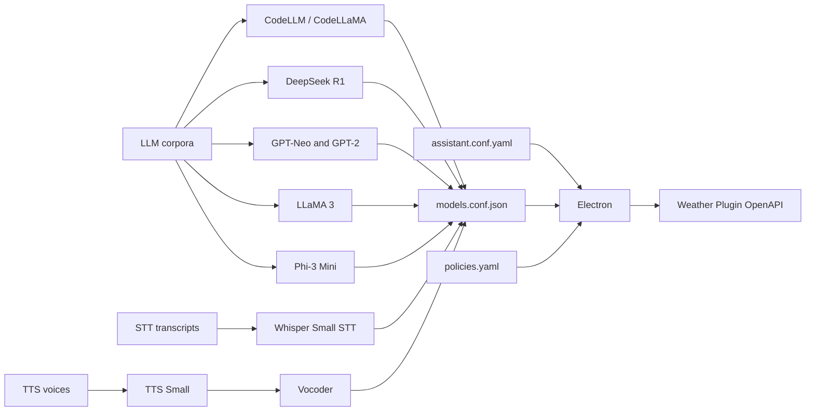

# IJAI Platform

[]()
[]()
[]()
[]()
[](https://t.me/IJAIprj)


( Work in progress )

IJAI is a modular AI platform that integrates **Large Language Models (LLM)**, **Speech-to-Text (STT)**, and **Text-to-Speech (TTS)** with a **cross-platform Electron + React desktop application**.
It provides a unified environment for **model management, dataset handling, configuration control, and plugin-based extensions**.

---

## Features

* Cross-platform **desktop application** (Electron).
* Integrated **LLM, STT, and TTS pipelines**.
* **Config-driven architecture** for models and assistant policies.
* Support for **custom datasets** and corpora.
* Extensible **plugin system** (OpenAPI-based).
* Prebuilt **model installers** and Python integration scripts.

---

## Repository Structure

```
App/                  – Electron + React application
IJAI-configs/         – Assistant and model configurations
dataset/              – Datasets for LLM, STT, and TTS
models/               – Integrated models and installers
plugins/              – Plugin system (OpenAPI-based)
share/lexicons/       – Lexicon resources
```

---

## File Overview

| Path                                                          | Description                                    |
| ------------------------------------------------------------- | ---------------------------------------------- |
| **App/src/assets/icons/IJAI-logo.png**                        | Application logo                               |
| **App/src/assets/icons/.gitkeep**                             | # gonna be released                            |
| **App/src/components/ChartCard.js**                           | Chart visualization component                  |
| **App/src/components/DataTable.js**                           | Tabular data component                         |
| **App/src/components/Header.js**                              | Application header                             |
| **App/src/components/Sidebar.js**                             | Sidebar navigation                             |
| **App/src/styles/dashboard.css**                              | Dashboard styling                              |
| **App/src/styles/material.css**                               | Material Design overrides                      |
| **App/index.html**                                            | Main HTML entry point                          |
| **App/renderer.js**                                           | Electron renderer process                      |
| **App/main.js**                                               | Electron main process                          |
| **App/preload.js**                                            | Secure preload bridge                          |
| **App/README.md**                                             | Documentation for app module                   |
| **App/electron-builder.yml**                                  | Build configuration (electron-builder)         |
| **App/forge.config.js**                                       | Forge build configuration                      |
| **App/package.json**                                          | NPM dependencies and scripts                   |
| **IJAI-configs/assistant.conf.yaml**                          | Assistant runtime configuration                |
| **IJAI-configs/models.conf.json**                             | Model registry definitions                     |
| **IJAI-configs/policies.yaml**                                | Policy rules                                   |
| **dataset/llm/set1/doc.md**                                   | LLM training notes                             |
| **dataset/llm/set2/.gitkeep**                                 | # gonna be released                            |
| **dataset/llm/set8/doc.md**                                   | Supplemental dataset                           |
| **dataset/llm/articles\_names.txt**                           | Corpus index of articles                       |
| **dataset/llm/doc.md**                                        | General dataset description                    |
| **dataset/stt/book1.txt**                                     | STT training text                              |
| **dataset/tts/voice1\_set/.gitkeep**                          | # gonna be released                            |
| **dataset/tts/voice2\_set/.gitkeep**                          | # gonna be released                            |
| **dataset/tts/README.md**                                     | TTS dataset documentation                      |
| **dataset/tts/book1.txt**                                     | TTS training corpus                            |
| **dataset/important.jl**                                      | Julia dataset file                             |
| **dataset/magnificent.asm**                                   | Assembly dataset (experimental)                |
| **dataset/examples/Текстовый документ.txt**                   | # gonna be released                            |
| **dataset/files/info/**                                       | Metadata resources                             |
| **models/codellm/README.md**                                  | Model documentation                            |
| **models/codellm/codellama.py**                               | Python integration                             |
| **models/codellm/installer.sh**                               | Installer script                               |
| **models/ollama-deepseekr1:8b/README.md**                     | Model documentation                            |
| **models/ollama-deepseekr1:8b/deepseekr1.py**                 | Python integration                             |
| **models/ollama-deepseekr1:8b/installer.sh**                  | Installer script                               |
| **models/llm/gpt-neo/gptneo.py**                              | GPT-Neo integration                            |
| **models/llm/gpt-neo/add\_info.md**                           | Additional notes                               |
| **models/llm/gpt-neo/merges.txt, vocab.json**                 | Tokenizer files                                |
| **models/llm/gpt-neo/special\_tokens\_map.json**              | Special tokens                                 |
| **models/llm/gpt-neo/tokenizer.json, tokenizer\_config.json** | Tokenizer configs                              |
| **models/llm/gpt2-medium/config.json**                        | Model configuration                            |
| **models/llm/gpt2-medium/gpt2m.py**                           | GPT-2 medium integration                       |
| **models/llm/gpt2-medium/tokinizer.json**                     | Tokenizer config (naming typo)                 |
| **models/ollama-llama3/DISCLAIMER.md**                        | Usage disclaimer                               |
| **models/ollama-llama3/installer.sh**                         | Installer script                               |
| **models/ollama-llama3/llm3.py**                              | Integration script                             |
| **models/phi3mini/**                                          | Phi-3 Mini model (weights, configs, tokenizer) |
| **models/stt/whisper-small/**                                 | Whisper model configs + integration script     |
| **models/tts/tts-small/Текстовый документ.txt**               | # gonna be released                            |
| **models/vocoder/Текстовый документ.txt**                     | # gonna be released                            |
| **plugins/weather/manifest.json**                             | Plugin manifest                                |
| **plugins/weather/openapi.yaml**                              | OpenAPI schema                                 |
| **share/lexicons/Текстовый документ.txt**                     | # gonna be released                            |
| **COMMERCIAL-LICENSE.md**                                     | Commercial license terms                       |
| **CONTRIBUTORS.md**                                           | Contributor acknowledgments                    |
| **LICENSE**                                                   | Open source license                            |
| **README.md**                                                 | Main documentation                             |
| **.gitignore**                                                | Git ignore rules                               |

---

## System Architecture



## Configuration

* **assistant.conf.yaml** – Core assistant runtime configuration.
* **models.conf.json** – Central model registry.
* **policies.yaml** – Execution and safety policies.

---

## Models

Supported families include:

* **CodeLLM** – Code generation.
* **DeepSeek R1** – Reasoning model.
* **GPT-Neo & GPT-2** – General language models.
* **LLaMA-3** – Open-source LLM.
* **Phi-3 Mini** – Lightweight transformer model.
* **Whisper Small** – Speech recognition.
* **TTS Small + Vocoder** – Speech synthesis.

Each model folder provides:

* Installer (`installer.sh`)
* Python integration (`*.py`)
* Tokenizer/configuration files
* Model weights (`.safetensors`)

---

## Datasets

* **LLM corpora** – Markdown/text resources.
* **STT corpora** – Speech recognition text files.
* **TTS corpora** – Voice datasets, transcripts.
* **Experimental** – Julia (`.jl`) and Assembly (`.asm`) files.

---

## Plugins

* **Weather plugin** as reference implementation.

  * `manifest.json` – Plugin declaration.
  * `openapi.yaml` – API specification.

---

## Installation

```bash
# Clone repository
git clone https://github.com/your-org/IJAI.git
cd IJAI

# Install frontend dependencies
cd App
npm install

# Run in development
npm start

# Build production desktop app
npm run build
```

Model installation is handled by individual `installer.sh` scripts inside each model folder.

---

## Usage

1. Start the Electron application.
2. Configure assistant and models via `IJAI-configs/`.
3. Place datasets in `dataset/`.
4. Install and load required models from `models/`.
5. Extend functionality with `plugins/`.

---

## Contributing

* Follow established coding standards.
* Submit pull requests for review.
* See `CONTRIBUTORS.md` for acknowledgments.

---


---

## Roadmap

### ✅ Completed (Ready for Release)
- [x] Core Electron ( betta version )
- [x] LLM integration (Phi-3 Mini, GPT-Neo, LLaMA-3, DeepSeek R1)  
- [ ] STT integration (Whisper Small)  
- [ ] TTS pipeline (TTS Small + Vocoder)  
- [x] Config-driven architecture (assistant, models, policies)  
- [x] Plugin framework (OpenAPI-based, example: Weather)  
- [x] Model installer scripts (`installer.sh`)  
- [x] Python integration for models (`*.py` bindings)  
- [x] Dataset ingestion (basic text/markdown corpora)  
- [x] Tokenizer and config handling (HF-compatible)  
- [x] Basic UI components (Sidebar, Header, DataTable, ChartCard)  
- [x] Build system (Forge + electron-builder)  

---

### 🧪 Demo / Experimental
- [ ] Model fine-tuning workflow (UI + CLI prototype)  
- [ ] Dataset management dashboard (alpha)  
- [ ] Interactive prompt playground for LLMs  
- [ ] Voice cloning demo for TTS  
- [ ] Speech-to-speech pipeline (STT → LLM → TTS)  
- [ ] Minimal plugin marketplace (manual install)  

---

### 🚧 In Progress
- [ ] Auto config saver on your flash drive
- [ ] GPU acceleration benchmarks (CUDA / ROCm)  
- [ ] Model caching & optimized loading (disk + RAM)  
- [ ] Dataset versioning & tagging  
- [ ] CLI tool (`ijai-cli`) for headless workflows  
- [ ] Enhanced error logging & monitoring dashboard  
- [ ] Extended plugin APIs (beyond Weather)  

---

### 🎯 Planned for Full Release
- [ ] Cloud sync & model sharing  
- [ ] Advanced policy engine (safety, filtering, sandboxing)  
- [ ] Fine-tuning UI (drag-and-drop datasets)  
- [ ] Multi-language UI (EN, RU, etc.)  
- [ ] Integration with external APIs (translation, search, etc.)  
- [ ] Plugin marketplace (in-app browsing & install)  
- [ ] Mobile companion app (view results, run lightweight tasks)  


## License

* **Open Source License**: `AGPLv3.0`
* **Commercial License**: `COMMERCIAL-LICENSE.md`


> Prebuilt model weights and installers are available via the official distribution channel: [Telegram](https://t.me/IJAIprj).
